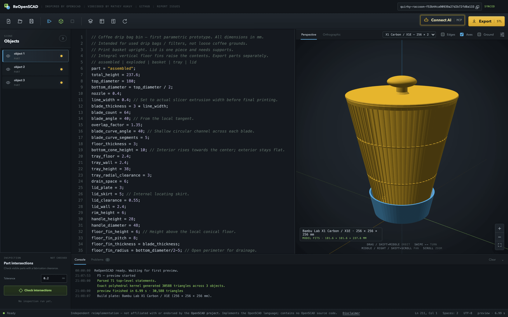

# ReOpenSCAD

OpenSCAD in the browser, rebuilt from scratch — a modern web workbench on top
of an independent Rust geometry engine. No OpenSCAD binary, no OpenSCAD
WebAssembly, no OpenSCAD source code: the lexer, parser, evaluator, CSG kernel
and exporters in this repository were all written here.



## What it does

Everything the desktop application does with a `.scad` file, minus the parts a
web app has no business keeping: no menu bar, no tabs, no file name. The
workspace *is* the document.

An empty workspace opens on a catalogue of eighteen printable models — mounts,
threads, household things, toys, hinged boxes, lettering — each one parametric,
each one rendered into its own preview by the app's own viewer. They live in
[`web/examples/`](web/examples/) as real `.scad` files, compiled by the test
suite and checked against the OpenSCAD binary, not as strings in a bundle.

It also does a few things the original does not:

* **Objects panel.** Every top-level solid listed on the left, each one able to
  be hidden on its own.
* **Build plates.** Put the model on the bed it will actually be printed on —
  current Bambu Lab, Creality, Prusa, Anycubic and Elegoo machines — and be
  told whether it fits. The choice follows you into new workspaces.
* **Intersection and clearance checking.** Find where parts collide, or where
  they are closer than a fabrication tolerance (0.2 mm by default), and see
  exactly where.
* **An MCP server.** Eight tools that let an AI agent create a workspace, query
  and patch the SCAD source, render, export, check clearances, and hand back a
  link. The browser picks up an agent's edits live and highlights what changed.

Export is STL, OFF, OBJ, 3MF or PNG.

## Running it

```sh
cargo run --manifest-path web/backend/Cargo.toml --release
```

Then open <http://127.0.0.1:5173>. That is the whole setup — the default build
has no dependencies beyond `serde`, and workspaces go to local JSON files.

For Docker, Postgres-backed storage and Cloud Run, see
[`web/README.md`](web/README.md) and [`web/DEPLOY.md`](web/DEPLOY.md).

## The geometry engine

An exact polyhedral CSG kernel: solids are polygon soups with exact planes,
booleans are computed by BSP classification rather than by sampling a distance
field, and every output edge is the exact intersection of two input planes.
Sharp edges survive exactly, and a swept wall that is not flat — a twisted
extrusion, a revolve — is split rather than fitted to a plane it does not lie
in.

One primitive is knowingly not OpenSCAD's. `text()` there fills an outline from
whatever font FreeType finds installed, so the same source renders differently
on two machines; here it draws with a single built-in monoline face and no
`font` to choose. The letterforms will not match OpenSCAD's, and cannot. What
they will do is render identically everywhere, forever, which is what a `.scad`
file in a repository actually needs.

It is held to OpenSCAD's own answers. Two corpora of `.scad` sources are
checked in alongside binary STL goldens that the OpenSCAD binary rendered from
them, and the tests compare what survives a different triangulation — volume,
surface area, watertightness, component count:

| | What it is | Where |
| --- | --- | --- |
| OpenAPPA | Smooth organic geometry the kernel already reproduced | `web/backend/tests/fixtures/openappa/` |
| Hard geometry | Near-tangent unions and sliver faces that used to break it | `web/backend/tests/fixtures/hard-geometry/` |

Both come out closed, with volume and surface area matching to eight or nine
significant figures. The hard-geometry fixtures each record the defect they
caught; their [README](web/backend/tests/fixtures/hard-geometry/README.md) is
the best account of how the kernel actually behaves.

```sh
cargo test --manifest-path web/backend/Cargo.toml   # engine and server
npm --prefix web test                               # frontend contracts
```

Language coverage lives in [`SPEC_LANG.md`](SPEC_LANG.md) and the
`web/backend/src/engine/spec_*.rs` tests. The remaining parity gaps are
described in [`web/backend/tests/README.md`](web/backend/tests/README.md).

## Workspaces

A workspace is one SCAD file with a funny ID in its URL, and that URL is the
only credential: anyone holding the link has full read and write. There are no
accounts.

**Share** offers two links. The one in the address bar is a capability to
*edit* — there is no login, so handing it over hands over write access. The
read-only link is an independent random token the server maps to the workspace
in one direction only: a holder cannot derive the editable link from it, which
is what makes it safe to paste where the editable one would not be. A read-only
view can render and export, and can copy the source into a workspace of its own.

Workspaces are kept indefinitely — nothing expires on a clock. The one limit is
capacity: a deployment holds a bounded number of them (512 by default, raised
with `REOPENSCAD_MAX_WORKSPACES`), and when it is full the least recently
touched one goes. On a shared instance that is somebody else's, so keep the
authoritative copy of anything you care about in a local `.scad` file.

Every workspace this browser has opened is listed on the empty-workspace
screen, newest first, with a thumbnail of its last render. That list lives in
the browser, not on the server — there are no accounts, so there is nobody to
attribute it to — and removing an entry from it does not touch the workspace.

## Independence and attribution

ReOpenSCAD is an independent reimplementation and is not affiliated with,
sponsored by, or endorsed by the OpenSCAD project. It implements the OpenSCAD
language and contains no OpenSCAD source code.

OpenSCAD itself is a separate project, licensed GPL-2.0-or-later and copyright
its authors. It lives at <https://openscad.org> and
<https://github.com/openscad/openscad>.

This project's own code is licensed under the **GNU General Public License,
version 3 or later** — see [`LICENSE`](LICENSE).
